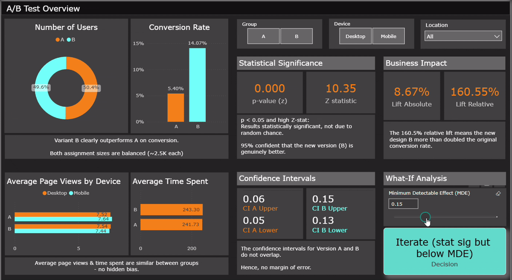

# A/B Testing Portfolio Project — Power BI & Excel

Demonstrates an end-to-end **A/B testing workflow** using real-world practices, showcasing data analysis, statistical testing, and business-ready reporting in **Excel** and **Power BI**.

The dataset (sourced from Kaggle) simulates user activity and conversion outcomes for two groups (A = control, B = variant). The goal is to determine whether variant B drives a statistically significant uplift in conversions compared to A.

---

## 📊 Demo 

---

## 🔑 Key Highlights
- **Tools Used**: Excel (sanity checks, stats), Power BI (data modeling, measures, dashboards).
- **Techniques Applied**:
  - Data cleaning & preparation
  - Sanity checks on randomization & sample balance
  - Conversion rate calculation
  - Hypothesis testing (two-proportion z-test in Excel, DAX measures in Power BI, Welch t-test)
  - Minimum Detectable Effect (MDE) analysis
  - Segmentation by device & location
  - Executive-level dashboards: What-If Analysis, Projected Business Impact

---

## 📊 Results (Summary)
- **Variant B outperformed Variant A**:
  - Conversion uplift: **+8.7 percentage points**
  - p-value < 0.05 → statistically significant
  - Meets company-defined **MDE** threshold
- Recommendation: **Ship Variant B** (higher conversions with confidence).

---
## 📬 Contact  
- LinkedIn: Kiran Gosavi (https://www.linkedin.com/in/kirangosavi/)
- Email: 26kirangosavi@gmail.com

